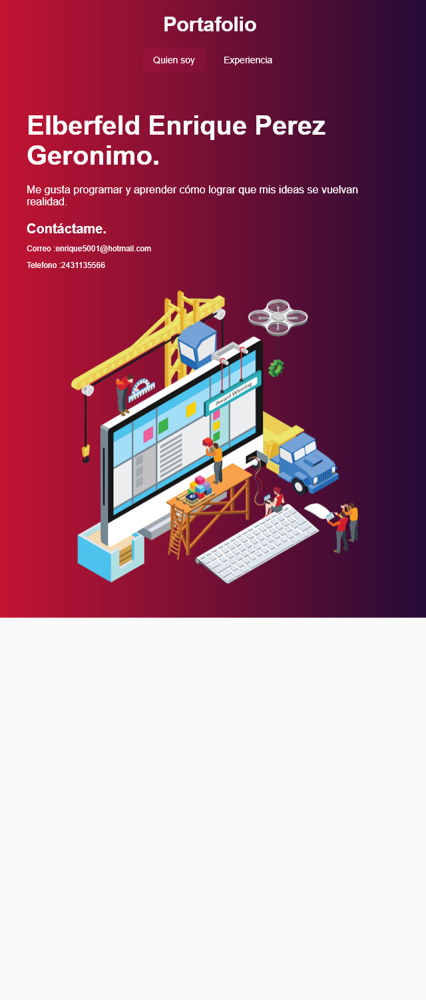

# Flutter web

Proyecto con flutter web y android

## Pagina

Puedes ver la pagina aqui [https://elberfeld2.github.io/flutter/](https://elberfeld2.github.io/flutter/)

<enrique5001@hotmail.com>

## Proyecto

Este proyecto fue basado en dos videos de youtube.

Primero hacer la interfaz esta debe ser responsiva.
[https://www.youtube.com/watch?v=rpkKYQCioW0&t=1111s](https://www.youtube.com/watch?v=rpkKYQCioW0&t=1111s)

Segundo generar la pagina a traves de Github actions.
[https://www.youtube.com/watch?v=UAeoRJ-eTU](https://www.youtube.com/watch?v=UAeoRJ-eTUo)

Por último, se agrego una nueva página para navegar entre ellas.

## Imagenes de la pagina 

Se hiso un pequeño test con puppeteer para visualizar la interfaz den diferentes resoluciones.

### Para movil

#### 640x360


#### 360x640


### Para móvil, pero para ver todo se aumentó la altura

#### 640x1500



#### 640x1500


### Para escritorio

#### 768x1366


#### 1366x768


### Tets

Este test fue desarrollado en node con puppeteer

```js
const puppeteer = require("puppeteer");

async function test({w,h}){
    // Lanzamos un nuevo navegador.
    const browser = await puppeteer.launch({
        defaultViewport: {
            width: parseInt(w),
            height: parseInt(h)
        }
    });
    // Abrimos una nueva página.
    const page = await browser.newPage();
    // Nos dirigimos a la pagina
    await page.goto("https://elberfeld2.github.io/flutter/#/");
    // Esperemos un tiempo a que cargue
    await await page.waitFor(5000);
    //Generamos una screenshot 
    await page.screenshot({ path: `img/Flutter_Test_${w}X${h}.png`, type: "png" });
    await page.close();
    await browser.close();
}


(() => {

    let tamaños = [
        {w:1366,h:768},{w:768,h:1366}, //Resolucion para escritorio
        {w:360,h:640},{w:640,h:360},   //Resolucion para celular
        {w:360,h:1500},{w:640,h:1500}  //Resolcion para celular pero con la altura modificada
    ];

    //Creamos un test por cada Resolucion
    for(let i=0;i<tamaños.length;i++){
        const tamaño = tamaños[i];
        test(tamaño);
    }
})();   

```
